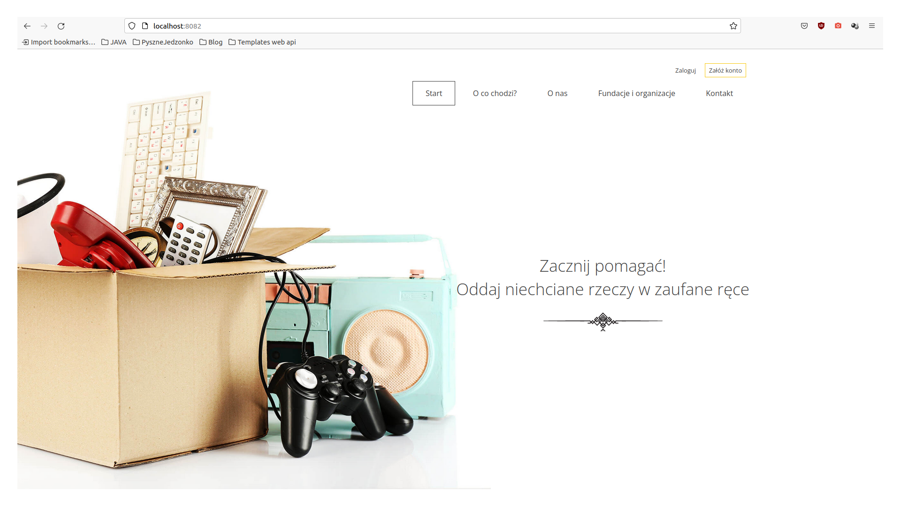
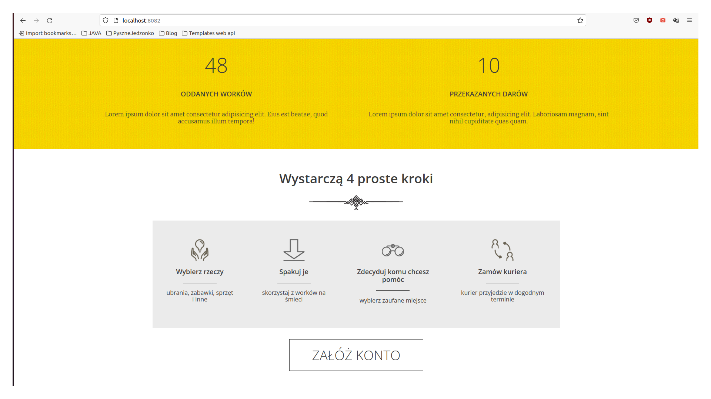

# GiveInGoodHandsApp
The aim of the project is to create a place where everyone can donate unnecessary things to trusted institutions.

# How it works?

The application requires an account. As a logged user, we can easily add a donation to a foundation of our choice.

The user can view and manage their donations through the user panel.

# What can a logged admin do?

The website administrator can easily manage users:

    -   add
    -   delete
    -   block
    -   give administrator rights
    -   add a new foundation

# Technologies used in this application

    -   Spring Boot
    -   Spring Security
    -   JavaScript in form (grant summary)

## Each of us can help, it is enough to want.

